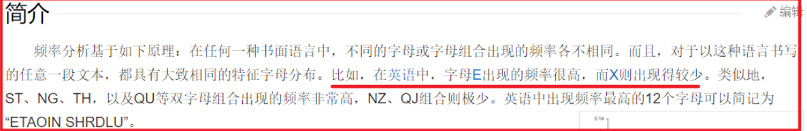

# 密码学

### 1.1 密码学基本概念

密码在我们的生活中有着重要的作用，那么密码究竟来自何方，为何会产生呢？

密码学是网络安全、信息安全、区块链等产品的基础，常见的非对称加密、对称加密、散列函数等，都属于密码学范畴。

密码学有数千年的历史，从最开始的替换法到如今的非对称加密算法，经历了古典密码学，近代密码学和现代密码学三个阶段。密码学不仅仅是数学家们的智慧，更是如今网络空间安全的重要基础。

#### 1.1.1 古典密码学

在古代的战争中，多见使用隐藏信息的方式保护重要的通信资料。比如先把需要保护的信息用化学药水写到纸上，药水干后，纸上看不出任何的信息，需要使用另外的化学药水涂抹后才可以阅读纸上的信息。

`https://www.iqiyi.com/v_19rt6ab1hg.html` 1分05秒

这些方法都是在保护重要的信息不被他人获取，但藏信息的方式比较容易被他人识破，例如增加哨兵的排查力度，就会发现其中的猫腻，因而随后发展出了较难破解的古典密码学。

① 替换法

替换法很好理解，就是用固定的信息将原文替换成无法直接阅读的密文信息。例如将 `b` 替换成 `w` ，`e` 替换成`p` ，这样`bee` 单词就变换成了`wpp`，不知道替换规则的人就无法阅读出原文的含义。

替换法有单表替换和多表替换两种形式。单表替换即只有一张原文密文对照表单，发送者和接收者用这张表单来加密解密。在上述例子中，表单即为：`a b c d e - s w t r p` 。

多表替换即有多张原文密文对照表单，不同字母可以用不同表单的内容替换。

例如约定好表单为：表单 `1：abcde-swtrp` 、表单`2：abcde-chfhk` 、表单 `3：abcde-jftou`。

规定第一个字母用第三张表单，第二个字母用第一张表单，第三个字母用第二张表单，这时 `bee`单词就变成了

`(312)fpk` ，破解难度更高，其中 312 又叫做密钥，密钥可以事先约定好，也可以在传输过程中标记出来。

② 移位法

移位法就是将原文中的所有字母都在字母表上向后（或向前）按照一个固定数目进行偏移后得出密文，典型的移位法应用有 “ 恺撒密码 ”。

例如约定好向后移动2位`（abcde - cdefg）`，这样 `bee` 单词就变换成了`dgg` 。

同理替换法，移位法也可以采用多表移位的方式，典型的多表案例是“维尼吉亚密码”（又译维热纳尔密码），属于多表密码的一种形式。


③ 古典密码破解方式

古典密码虽然很简单，但是在密码史上是使用的最久的加密方式，直到“概率论”的数学方法被发现，古典密码就被破解了。


英文单词中字母出现的频率是不同的，e以12.702%的百分比占比最高，z 只占到0.074%，感兴趣的可以去百科查字母频率详细统计数据。如果密文数量足够大，仅仅采用频度分析法就可以破解单表的替换法或移位法。



多表的替换法或移位法虽然难度高一些，但如果数据量足够大的话，也是可以破解的。以维尼吉亚密码算法为例，破解方法就是先找出密文中完全相同的字母串，猜测密钥长度，得到密钥长度后再把同组的密文放在一起，使用频率分析法破解。

#### 1.1.2 近代密码学

古典密码的安全性受到了威胁，外加使用便利性较低，到了工业化时代，近现代密码被广泛应用。

恩尼格玛机

恩尼格玛机是二战时期纳粹德国使用的加密机器，后被英国破译，参与破译的人员有被称为计算机科学之父、人工智能之父的图灵。


恩尼格玛机

恩尼格玛机使用的加密方式本质上还是移位和替代，只不过因为密码表种类极多，破解难度高，同时加密解密机器化，使用便捷，因而在二战时期得以使用。

#### 1.1.3 现代密码学

① 散列函数

散列函数，也叫杂凑函数、摘要函数或哈希函数，可将任意长度的消息经过运算，变成固定长度数值，常见的有`MD5`、`SHA-1`、`SHA256`，多应用在文件校验，数字签名中。

MD5 可以将任意长度的原文生成一个128位（16字节）的哈希值

SHA-1可以将任意长度的原文生成一个160位（20字节）的哈希值

② 对称密码

对称密码应用了相同的加密密钥和解密密钥。对称密码分为：序列密码(流密码)，分组密码(块密码)两种。流密码是对信息流中的每一个元素（一个字母或一个比特）作为基本的处理单元进行加密，块密码是先对信息流分块，再对每一块分别加密。

例如原文为1234567890，流加密即先对1进行加密，再对2进行加密，再对3进行加密……最后拼接成密文；块加密先分成不同的块，如1234成块，5678成块，90XX(XX为补位数字)成块，再分别对不同块进行加密，最后拼接成密文。前文提到的古典密码学加密方法，都属于流加密。

③ 非对称密码

对称密码的密钥安全极其重要，加密者和解密者需要提前协商密钥，并各自确保密钥的安全性，一但密钥泄露，即使算法是安全的也无法保障原文信息的私密性。

在实际的使用中，远程的提前协商密钥不容易实现，即使协商好，在远程传输过程中也容易被他人获取，因此非对称密钥此时就凸显出了优势。

非对称密码有两支密钥，公钥（publickey）和私钥（privatekey），加密和解密运算使用的密钥不同。用公钥对原文进行加密后，需要由私钥进行解密；用私钥对原文进行加密后（此时一般称为签名），需要由公钥进行解密（此时一般称为验签）。公钥可以公开的，大家使用公钥对信息进行加密，再发送给私钥的持有者，私钥持有者使用私钥对信息进行解密，获得信息原文。因为私钥只有单一人持有，因此不用担心被他人解密获取信息原文。

#### 1.1.4 如何设置密码才安全

- 密码不要太常见，不要使用类似于123456式的常用密码。
- 各应用软件密码建议不同，避免出现一个应用数据库被脱库，全部应用密码崩塌，
- 可在设置密码时增加注册时间、注册地点、应用特性等方法。例如tianjin123456，表示在天津注册的该应用。

### 1.2 ASCII编码

ASCII（American Standard Code for Information Interchange，美国信息交换标准代码）是基于拉丁字母的一套电脑编码系统，主要用于显示现代英语和其他西欧语言。它是现今最通用的单字节编码系统，并等同于国际标准ISO/IEC 646。


### 1.3 恺撒加密

#### 1.3.1 中国古代加密

看一个小故事 ， 看看古人如何加密和解密：

公元683年，唐中宗即位。随后，武则天废唐中宗，立第四子李旦为皇帝，但朝政大事均由她自己专断。　　

　　裴炎、徐敬业和骆宾王等人对此非常不满。徐敬业聚兵十万，在江苏扬州起兵。裴炎做内应，欲以拆字手段为其传递秘密信息。后因有人告密，裴炎被捕，未发出的密信落到武则天手中。这封密信上只有“青鹅”二字，群臣对此大惑不解。　　

　　武则天破解了“青鹅”的秘密：“青”字拆开来就是“十二月”，而“鹅”字拆开来就是“我自与”。密信的意思是让徐敬业、骆宾王等率兵于十二月进发，裴炎在内部接应。“青鹅”破译后，裴炎被杀。接着，武则天派兵击败了徐敬业和骆宾王。


#### 1.3.2 外国加密

在密码学中，恺撒密码是一种最简单且最广为人知的加密技术。

凯撒密码最早由古罗马军事统帅盖乌斯·尤利乌斯·凯撒在军队中用来传递加密信息，故称凯撒密码。这是一种位移加密方式，只对26个字母进行位移替换加密，规则简单，容易破解。下面是位移1次的对比：


将明文字母表向后移动1位，A变成了B，B变成了C……，Z变成了A。同理，若将明文字母表向后移动3位：


则A变成了D，B变成了E……，Z变成了C。

字母表最多可以移动25位。凯撒密码的明文字母表向后或向前移动都是可以的，通常表述为向后移动，如果要向前移动1位，则等同于向后移动25位，位移选择为25即可。

它是一种替换加密的技术，明文中的所有字母都在字母表上向后（或向前）按照一个固定数目进行偏移后被替换成密文。

例如，当偏移量是3的时候，所有的字母A将被替换成D，B变成E，以此类推。

这个加密方法是以恺撒的名字命名的，当年恺撒曾用此方法与其将军们进行联系。

恺撒密码通常被作为其他更复杂的加密方法中的一个步骤。


**简单来说就是当秘钥为n，其中一个待加密字符ch，加密之后的字符为ch+n，当ch+n超过’z’时，回到’a’计数。**

#### 1.3.3 凯撒位移加密

```java
/**
 * 凯赛加密，主要思想为位移
 * Create BY poplar ON 2020/5/29
 */
public class KaiserEncrypt {

    public static void main(String[] args) {
        String mata = "Hello World";
        int key = 3;
        String encryptStr = kaiserEncrypt(mata, key);
        System.out.println(encryptStr);
        String encrypt = kaiserDecrypt(encryptStr, key);
        System.out.println(encrypt);
    }

    //解密
    private static String kaiserDecrypt(String mata, int key) {
        StringBuilder sb = new StringBuilder();
        char[] chars = mata.toCharArray();
        for (char aChar : chars) {
            int input = aChar;
            input -= key;
            char newChar = (char) input;
            sb.append(newChar);
        }
        return sb.toString();
    }

    //凯赛加密
    private static String kaiserEncrypt(String mata, int key) {
        StringBuilder sb = new StringBuilder();
        char[] chars = mata.toCharArray();
        for (char aChar : chars) {
            int input = aChar;
            input += key;
            char newChar = (char) input;
            sb.append(newChar);
        }
        return sb.toString();
    }
}
```

### 1.4 频度分析法破解恺撒加密

**密码棒**

公元前5世纪的时候，斯巴达人利用一根木棒，缠绕上皮革或者羊皮纸，在上面横向写下信息，解下这条皮带。展开来看，这长串字母没有任何意义。

比如这样：


信差可以将这条皮带当成腰带，系在腰上。

比如这样：


然后收件人将这条皮带缠绕在相同的木棒上，就能恢复信息了。

前404年，一位遍体鳞伤的信差来到斯巴达将领利桑德面前，这趟波斯之旅只有他和四位同伴幸存，利桑德接下腰带，缠绕到他的密码棒上，得知波斯的发那巴祖斯准备侵袭他，多亏密码棒利桑德才能够预先防范，击退敌军。

**频率分析解密法**

密码棒是不是太简单了些？

加密者选择将组成信息的字母替代成别的字母，比如说将a写成1，这样就不能被解密者直接拿到信息了。

这难不倒解密者，以英文字母为例，为了确定每个英文字母的出现频率，分析一篇或者数篇普通的英文文章，英文字母出现频率最高的是e，接下来是t，然后是a……，然后检查要破解的密文，也将每个字母出现的频率整理出来，假设密文中出现频率最高的字母是j，那么就可能是e的替身，如果密码文中出现频率次高的但是P，那么可能是t的替身，以此类推便就能解开加密信息的内容。这就是频率分析法。

- 将明文字母的出现频率与密文字母的频率相比较的过程
- 通过分析每个符号出现的频率而轻易地破译代换式密码
- 在每种语言中，冗长的文章中的字母表现出一种可对之进行分辨的频率。
- e是英语中最常用的字母，其出现频率为八分之一

### 1.5 常见加密方式


#### 1.5.1 对称加密

- 采用单钥密码系统的加密方法，同一个密钥可以同时用作信息的加密和解密，这种加密方法称为对称加密，也称为单密钥加密。
- 示例
  - 我们现在有一个原文3要发送给B
  - 设置密钥为108, 3 * 108 = 324, 将324作为密文发送给B
  - B拿到密文324后, 使用324/108 = 3 得到原文
- 常见加密算法
  - DES : Data Encryption Standard，即数据加密标准，是一种使用密钥加密的块算法，1977年被美国联邦政府的国家标准局确定为联邦资料处理标准（FIPS），并授权在非密级政府通信中使用，随后该算法在国际上广泛流传开来。
  - AES : Advanced Encryption Standard, 高级加密标准 .在密码学中又称Rijndael加密法，是美国联邦政府采用的一种区块加密标准。这个标准用来替代原先的DES，已经被多方分析且广为全世界所使用。
- 特点
  - 加密速度快, 可以加密大文件
  - 密文可逆, 一旦密钥文件泄漏, 就会导致数据暴露
  - 加密后编码表找不到对应字符, 出现乱码
  - 一般结合Base64使用

#### 1.5.2 DES加密

示例代码 des加密算法

```java

/**
 * Create BY poplar ON 2020/5/30
 */
public class DesAesTest {

    public static void main(String[] args) throws Exception {
        // 原文
        String input = "中国";
        // des加密必须是8位
        String key = "12345678";
        // 算法
        String algorithm = "DES";

        String transformation = "DES";
        // Cipher：密码，获取加密对象
        // transformation:参数表示使用什么类型加密
        Cipher cipher = Cipher.getInstance(transformation);
        // 指定秘钥规则
        // 第一个参数表示：密钥，key的字节数组
        // 第二个参数表示：算法
        SecretKeySpec sks = new SecretKeySpec(key.getBytes(), algorithm);
        // 对加密进行初始化
        // 第一个参数：表示模式，有加密模式和解密模式
        // 第二个参数：表示秘钥规则
        cipher.init(Cipher.ENCRYPT_MODE, sks);
        // 进行加密
        byte[] bytes = cipher.doFinal(input.getBytes());
        // 打印字节，因为ascii码有负数，解析不出来，所以乱码
        for (byte b : bytes) {
            System.out.println(b);
        }
        // 打印密文
        System.out.println(new String(bytes));
    }

}
```

如果key长度不满足8位运行会报错


修改 密钥 key = “12345678” ，再次运行 ，出现乱码是因为对应的字节出现负数，但负数，没有出现在 ascii 码表里面，所以出现乱码，需要配合base64进行转码


使用 `base64` 进行编码

`base64` 导包的时候，需要注意 ，别导错了，需要导入 `apache` 包

```java
 //使用Base64编码
 // 打印密文
 System.out.print(new String(Base64.encode(bytes)));
```


#### 1.5.4 DES解密

```java
/**
 * Create BY poplar ON 2020/5/30
 */
public class DesTest {

    public static void main(String[] args) throws Exception {
        // 原文
        String input = "中国";
        // des加密必须是8位
        String key = "12345678";
        // 算法
         String algorithm = "DES";
        String transformation = "DES";
        // 算法
        String desEncrypt = desEncrpyt(input, key, algorithm, transformation);
        System.out.println(desEncrypt);
        System.out.println(desDecrypt(desEncrypt, key, algorithm, transformation));
    }

     private static String desEncrpyt(String input, String key, String algorithm, String transformation) throws Exception {
        // Cipher：密码，获取加密对象
        // transformation:参数表示使用什么类型加密
        Cipher cipher = Cipher.getInstance(transformation);
        // 指定秘钥规则
        // 第一个参数表示：密钥，key的字节数组
        // 第二个参数表示：算法
        SecretKeySpec sks = new SecretKeySpec(key.getBytes(), algorithm);
        // 对加密进行初始化
        // 第一个参数：表示模式，有加密模式和解密模式
        // 第二个参数：表示秘钥规则
        cipher.init(Cipher.ENCRYPT_MODE, sks);
        // 进行加密
        byte[] bytes = cipher.doFinal(input.getBytes());
        // 打印字节，因为ascii码有负数，解析不出来，所以乱码
       /* for (byte b : bytes) {
            System.out.println(b);
        }*/
        //使用Base64编码
        return Base64.encode(bytes);
    }

    private static String desDecrypt(String input, String key, String algorithm, String transformation) throws Exception {

        // Cipher：密码，获取加密对象
        // transformation:参数表示使用什么类型加密
        Cipher cipher = Cipher.getInstance(transformation);
        // 指定秘钥规则
        // 第一个参数表示：密钥，key的字节数组
        // 第二个参数表示：算法
        SecretKeySpec sks = new SecretKeySpec(key.getBytes(), algorithm);
        // 对加密进行初始化
        // 第一个参数：表示模式，有加密模式和解密模式
        // 第二个参数：表示秘钥规则
        cipher.init(Cipher.DECRYPT_MODE, sks);
        //使用base64解码
        // 进行加密
        byte[] bytes = cipher.doFinal(Base64.decode(input));
        // 返回解密后的值
        return new String(bytes);
    }
```


- Base64 算法简介

  Base64是网络上最常见的用于传输8Bit字节码的可读性编码算法之一
  可读性编码算法不是为了保护数据的安全性，而是为了可读性
  可读性编码不改变信息内容，只改变信息内容的表现形式
  所谓Base64，即是说在编码过程中使用了64种字符：大写A到Z、小写a到z、数字0到9、“+”和“/”
  Base58是Bitcoin(比特币)中使用的一种编码方式，主要用于产生Bitcoin的钱包地址
  相比Base64，Base58不使用数字"0"，字母大写"O"，字母大写"I"，和字母小写"i"，以及"+"和"/"符号

- Base64 算法原理

base64 是 3个字节为一组，一个字节 8位，一共 就是24位 ，然后，把3个字节转成4组，每组6位，

3 * 8 = 4 * 6 = 24 ，每组6位，缺少的2位，会在高位进行补0 ，这样做的好处在于 ，base取的是后面6位，去掉高2位 ，那么base64的取值就可以控制在0-63位了，所以就叫base64，111 111 = 32 + 16 + 8 + 4 + 2 + 1 =

- base64 构成原则

① 小写 a - z = 26个字母

② 大写 A - Z = 26个字母

③ 数字 0 - 9 = 10 个数字

④ + / = 2个符号

大家可能发现一个问题，咱们的base64有个 = 号，但是在映射表里面没有发现 = 号 ， 这个地方需要注意，等号非常特殊，因为base64是三个字节一组 ，如果当我们的位数不够的时候，会使用等号来补齐


#### 1.5.5 AES加密解密

```java
/**
 * Create BY poplar ON 2020/5/30
 */
public class AesTest {


    public static void main(String[] args) throws Exception {
        String input = "中国";
        // AES加密算法，比较高级，所以key的大小必须是16个字节
        String key = "1234567812345678";

        String transformation = "AES";
        // 指定获取密钥的算法
        String algorithm = "AES";
        // 先测试加密，然后在测试解密
        String encryptAES = encryptAES(input, key, transformation, algorithm);
        System.out.println("加密:" + encryptAES);
        String s = decryptAES(encryptAES, key, transformation, algorithm);
        System.out.println("解密:" + s);

    }

    /**
     * 使用AES加密数据
     *
     * @param input          : 原文
     * @param key            : 密钥(AES,密钥的长度必须是8个字节)
     * @param transformation : 获取Cipher对象的算法
     * @param algorithm      : 获取密钥的算法
     * @return : 密文
     * @throws Exception
     */
    private static String encryptAES(String input, String key, String transformation, String algorithm) throws Exception {
        // 获取加密对象
        Cipher cipher = Cipher.getInstance(transformation);
        // 创建加密规则
        // 第一个参数key的字节
        // 第二个参数表示加密算法
        SecretKeySpec sks = new SecretKeySpec(key.getBytes(), algorithm);
        // ENCRYPT_MODE：加密模式
        // DECRYPT_MODE: 解密模式
        // 初始化加密模式和算法
        cipher.init(Cipher.ENCRYPT_MODE, sks);
        // 加密
        byte[] bytes = cipher.doFinal(input.getBytes());

        // 输出加密后的数据
        return Base64.encode(bytes);
    }

    /**
     * 使用AES解密
     *
     * @param input          : 密文
     * @param key            : 密钥
     * @param transformation : 获取Cipher对象的算法
     * @param algorithm      : 获取密钥的算法
     * @throws Exception
     * @return: 原文
     */
    private static String decryptAES(String input, String key, String transformation, String algorithm) throws Exception {
        // 1,获取Cipher对象
        Cipher cipher = Cipher.getInstance(transformation);
        // 指定密钥规则
        SecretKeySpec sks = new SecretKeySpec(key.getBytes(), algorithm);
        cipher.init(Cipher.DECRYPT_MODE, sks);
        // 3. 解密
        byte[] bytes = cipher.doFinal(Base64.decode(input));

        return new String(bytes);
    }
}
```


### 1.6 加密模式

加密模式：`https://docs.oracle.com/javase/8/docs/api/javax/crypto/Cipher.html`

#### [ECB](#ecb)

ECB : Electronic codebook, 电子密码本. 需要加密的消息按照块密码的块大小被分为数个块，并对每个块进行独立加密


- 优点 : 可以并行处理数据
- 缺点 : 同样的原文生成同样的密文, 不能很好的保护数据
- 同时加密，原文是一样的，加密出来的密文也是一样的

#### [CBC](#cbc)

CBC : Cipher-block chaining, 密码块链接. 每个明文块先与前一个密文块进行异或后，再进行加密。在这种方法中，每个密文块都依赖于它前面的所有明文块


- 优点 : 同样的原文生成的密文不一样
- 缺点 : 串行处理数据.

### 1.7 填充模式

- 当需要按块处理的数据, 数据长度不符合块处理需求时, 按照一定的方法填充满块长的规则

#### [NoPadding](#nopadding)

- 不填充.
- 在DES加密算法下, 要求原文长度必须是8byte的整数倍
- 在AES加密算法下, 要求原文长度必须是16byte的整数倍

#### [PKCS5Padding](#pkcs5padding)

数据块的大小为8位, 不够就补足

#### [Tips](#tips)

- 默认情况下, 加密模式和填充模式为 : ECB/PKCS5Padding
- 如果使用CBC模式, 在初始化Cipher对象时, 需要增加参数, 初始化向量IV : IvParameterSpec iv = new IvParameterSpec(key.getBytes());

加密模式和填充模式

```java
Every implementation of the Java platform is required to support the following standard Cipher transformations with the keysizes in parentheses:
AES/CBC/NoPadding (128)
AES/CBC/PKCS5Padding (128)
AES/ECB/NoPadding (128)
AES/ECB/PKCS5Padding (128)
DES/CBC/NoPadding (56)
DES/CBC/PKCS5Padding (56)
DES/ECB/NoPadding (56)
DES/ECB/PKCS5Padding (56)
DESede/CBC/NoPadding (168)
DESede/CBC/PKCS5Padding (168)
DESede/ECB/NoPadding (168)
DESede/ECB/PKCS5Padding (168)
RSA/ECB/PKCS1Padding (1024, 2048)
RSA/ECB/OAEPWithSHA-1AndMGF1Padding (1024, 2048)
RSA/ECB/OAEPWithSHA-256AndMGF1Padding (1024, 2048)
These transformations are described in the Cipher section of the Java Cryptography Architecture Standard Algorithm Name Documentation. Consult the release documentation for your implementation to see if any other transformations are supported.
```

加密模式和填充模式例子

```java
package com.poplar.des;

import com.sun.org.apache.xml.internal.security.utils.Base64;

import javax.crypto.Cipher;
import javax.crypto.spec.SecretKeySpec;

/**
 * Create BY poplar ON 2020/5/30
 */
public class DesAesTest {

    public static void main(String[] args) throws Exception {
        // 原文
        String input = "中国";
        // des加密必须是8位
        String key = "12345678";
        String algorithm = "DES";
        //默认的模式 DES/ECB/PKCS5Padding
        String transformation = "DES/ECB/PKCS5Padding";
        // 算法
        String desEncrypt = desEncrpyt(input, key, algorithm, transformation);
        System.out.println(desEncrypt);
        System.out.println(desDecrypt(desEncrypt, key, algorithm, transformation));
    }

    private static String desEncrpyt(String input, String key, String algorithm, String transformation) throws Exception {
        // Cipher：密码，获取加密对象
        // transformation:参数表示使用什么类型加密
        Cipher cipher = Cipher.getInstance(transformation);
        // 指定秘钥规则
        // 第一个参数表示：密钥，key的字节数组
        // 第二个参数表示：算法
        SecretKeySpec sks = new SecretKeySpec(key.getBytes(), algorithm);
        // 对加密进行初始化
        // 第一个参数：表示模式，有加密模式和解密模式
        // 第二个参数：表示秘钥规则
        cipher.init(Cipher.ENCRYPT_MODE, sks);
        // 进行加密
        byte[] bytes = cipher.doFinal(input.getBytes());
        // 打印字节，因为ascii码有负数，解析不出来，所以乱码
       /* for (byte b : bytes) {
            System.out.println(b);
        }*/
        //使用Base64编码
        // 打印密文
        return Base64.encode(bytes);
    }

    private static String desDecrypt(String input, String key, String algorithm, String transformation) throws Exception {

        // Cipher：密码，获取加密对象
        // transformation:参数表示使用什么类型加密
        Cipher cipher = Cipher.getInstance(transformation);
        // 指定秘钥规则
        // 第一个参数表示：密钥，key的字节数组
        // 第二个参数表示：算法
        SecretKeySpec sks = new SecretKeySpec(key.getBytes(), algorithm);
        // 对加密进行初始化
        // 第一个参数：表示模式，有加密模式和解密模式
        // 第二个参数：表示秘钥规则
        cipher.init(Cipher.DECRYPT_MODE, sks);
        //使用base64解码
        byte[] decode = Base64.decode(input);
        // 进行加密
        byte[] bytes = cipher.doFinal(decode);
        // 打印字节，因为ascii码有负数，解析不出来，所以乱码
        // 返回解密后的值
        return new String(bytes);
    }
}

```

换成 `DES/CBC/PKCS5Padding`


加上代码后解密成功

```java
 		// 初始向量，参数表示跟谁进行异或，初始向量的长度必须是8位
        IvParameterSpec ips = new IvParameterSpec(key.getBytes());
        // 对加密进行初始化
        // 第一个参数：表示模式，有加密模式和解密模式
        // 第二个参数：表示秘钥规则
        cipher.init(Cipher.DECRYPT_MODE, sks, ips);
```

修改填充模式

```java
String transformation = "DES/CBC/NoPadding";
```

运行报错 `NoPadding` 这种填充模式 原文必须是8个字节的整倍数


在测试 `AES` 的时候需要注意，key需要16个字节，加密向量也需要16个字节 ，其他方式跟 `DES` 一样

### 1.9 消息摘要

- 消息摘要（Message Digest）又称为数字摘要(Digital Digest)
- 它是一个唯一对应一个消息或文本的固定长度的值，它由一个单向Hash加密函数对消息进行作用而产生
- 使用数字摘要生成的值是不可以篡改的，为了保证文件或者值的安全

#### 1.8.1 特点

无论输入的消息有多长，计算出来的消息摘要的长度总是固定的。例如应用MD5算法摘要的消息有128个比特位，用SHA-1算法摘要的消息最终有160比特位的输出

只要输入的消息不同，对其进行摘要以后产生的摘要消息也必不相同；但相同的输入必会产生相同的输出

消息摘要是单向、不可逆的

常见算法 :

```java
- MD5
- SHA1
- SHA256
- SHA512
```

[在线获取消息摘要](http://tool.oschina.net/encrypt?type=2)

百度搜索 `tomcat` ，进入官网下载 ，会经常发现有 `sha1`，`sha512` , 这些都是数字摘要


数字摘要


#### 1.8.2 获取字符串消息摘要

```java
/**
 * Create BY poplar ON 2020/5/30
 */
public class DigestTest {
    public static void main(String[] args) throws Exception {
        // 原文
        String input = "aa";
        // 算法
        String algorithm = "MD5";
        // 获取数字摘要对象
        MessageDigest messageDigest = MessageDigest.getInstance(algorithm);
        // 获取消息数字摘要的字节数组
        byte[] digest = messageDigest.digest(input.getBytes());
        for (byte b : digest) {
            System.out.println(b);
        }
        System.out.println(new String(digest));
    }
}

```


由于出现负数，所以出现乱码，此时需要使用base64编码

```java
System.out.println(Base64.encode(digest));
```

在线MD5“中国”的值

`c13dceabcb143acd6c9298265d618a9f`

base64编码

`wT3Oq8sUOs1skpgmXWGKnw==`

使用在线 md5 加密 ，发现我们生成的值和代码生成的值不一样，那是因为消息摘要不是使用base64进行编码的，所以我们需要把值转成16进制

```java
/**
 * Create BY poplar ON 2020/5/30
 */
public class DigestTest {
    public static void main(String[] args) throws Exception {
        // 原文
        String input = "中国";
        // 算法
        String algorithm = "MD5";
        // 获取数字摘要对象
        MessageDigest messageDigest = MessageDigest.getInstance(algorithm);
        // 获取消息数字摘要的字节数组
        byte[] digest = messageDigest.digest(input.getBytes());
        StringBuilder sb = new StringBuilder();
        for (byte b : digest) {
            String hexString = Integer.toHexString(b & 0xff);
             // 如果生成的字符只有一个，前面补0
            if (hexString.length() == 1) {
                hexString = "0" + hexString;
            }
            sb.append(hexString);
        }
        System.out.println(sb.toString());
    }
}

```

运行结果：`c13dceabcb143acd6c9298265d618a9f`

#### 1.8.4 其他数字摘要算法

```java
/**
 * Create BY poplar ON 2020/5/30
 */
public class OtherDigest {
    public static void main(String[] args) throws Exception {
        // 原文
        String input = "aa";
        // 算法
        String algorithm = "MD5";
        // 获取数字摘要对象
        String md5 = getDigest(input, "MD5");
        System.out.println(md5);

        String sha1 = getDigest(input, "SHA-1");
        System.out.println(sha1);

        String sha256 = getDigest(input, "SHA-256");
        System.out.println(sha256);

        String sha512 = getDigest(input, "SHA-512");
        System.out.println(sha512);
    }

    private static String toHex(byte[] digest) throws Exception {

        StringBuilder sb = new StringBuilder();
        for (byte b : digest) {
            // 转成 16进制
            String s = Integer.toHexString(b & 0xff);
            if (s.length() == 1) {
                // 如果生成的字符只有一个，前面补0
                s = "0" + s;
            }
            sb.append(s);
        }
        System.out.println("16进制数据的长度：" + sb.toString().getBytes().length);
        return sb.toString();
    }

    private static String getDigest(String input, String algorithm) throws Exception {
        MessageDigest messageDigest = MessageDigest.getInstance(algorithm);
        // 消息数字摘要
        byte[] digest = messageDigest.digest(input.getBytes());
        System.out.println("密文的字节长度:" + digest.length);

        return toHex(digest);
    }
}
```


### 1.9 非对称加密

**简介：**

① 非对称加密算法又称`现代加密算法`。

② 非对称加密是计算机通信安全的基石，保证了加密数据`不会被破解`。

③ 与对称加密算法不同，非对称加密算法需要两个密钥：`公开密钥(publickey)` 和`私有密(privatekey)`

④ 公开密钥和私有密钥是`一对`

⑤ 如果用`公开密钥`对数据进行`加密`，只有用`对应的私有密钥`才能`解密`。

⑥ 如果用`私有密钥`对数据进行`加密`，只有用`对应的公开密钥`才能`解密`。

⑦ 因为加密和解密使用的是两个`不同`的密钥，所以这种算法叫作`非对称加密算法`。

- 示例
  - 首先生成密钥对, 公钥为(5,14), 私钥为(11,14)
  - 现在A希望将原文2发送给B
  - A使用公钥加密数据. 2的5次方mod 14 = 4 , 将密文4发送给B
  - B使用私钥解密数据. 4的11次方mod14 = 2, 得到原文2
- 特点
  - 加密和解密使用不同的密钥
  - 如果使用私钥加密, 只能使用公钥解密
  - 如果使用公钥加密, 只能使用私钥解密
  - 处理数据的速度较慢, 因为安全级别高
- 常见算法
  - RSA
  - ECC

#### 1.9.1 生成公钥和私钥

```java

/**
 * Create BY poplar ON 2020/5/30
 * 非对称加密生成公钥和私钥
 */
public class KeyPairGeneratorTest {

    public static void main(String[] args) throws Exception {
        // 加密算法
        String algorithm = "RSA";
        //  创建密钥对生成器对象
        KeyPairGenerator keyPairGenerator = KeyPairGenerator.getInstance(algorithm);
        // 生成密钥对
        KeyPair keyPair = keyPairGenerator.generateKeyPair();
        // 生成私钥
        PrivateKey privateKey = keyPair.getPrivate();
        // 生成公钥
        PublicKey publicKey = keyPair.getPublic();
        // 获取私钥字节数组
        byte[] privateKeyEncoded = privateKey.getEncoded();
        // 获取公钥字节数组
        byte[] publicKeyEncoded = publicKey.getEncoded();
        // 对公私钥进行base64编码
        String privateKeyString = Base64.encode(privateKeyEncoded);
        String publicKeyString = Base64.encode(publicKeyEncoded);
        // 打印私钥
        System.out.println(privateKeyString);
        // 打印公钥
        System.out.println(publicKeyString);
    }
}
```


#### 1.9.2 私钥加密----私钥解密

```java
 public static void main(String[] args) throws Exception {
        String input = "中国";
        // 加密算法
        String algorithm = "RSA";
        //  创建密钥对生成器对象
        KeyPairGenerator keyPairGenerator = KeyPairGenerator.getInstance(algorithm);
        // 生成密钥对
        KeyPair keyPair = keyPairGenerator.generateKeyPair();
        // 生成私钥
        PrivateKey privateKey = keyPair.getPrivate();
        // 创建加密对象
        // 参数表示加密算法
        Cipher cipher = Cipher.getInstance(algorithm);
        // 初始化加密
        // 第一个参数:加密的模式
        // 第二个参数：使用私钥进行加密
        cipher.init(Cipher.ENCRYPT_MODE, privateKey);
        // 私钥加密
        byte[] bytes = cipher.doFinal(input.getBytes());
        System.out.println(Base64.encode(bytes));
        // 私钥进行解密
        cipher.init(Cipher.DECRYPT_MODE, privateKey);
        // 对密文进行解密，不需要使用base64，因为原文不会乱码
        byte[] bytes1 = cipher.doFinal(bytes);
        System.out.println(new String(bytes1));
    }
```


#### 1.9.3私钥加密公钥解密

```java
public static void main(String[] args) throws Exception {
        String input = "中国";
        // 加密算法
        String algorithm = "RSA";
        //  创建密钥对生成器对象
        KeyPairGenerator keyPairGenerator = KeyPairGenerator.getInstance(algorithm);
        // 生成密钥对
        KeyPair keyPair = keyPairGenerator.generateKeyPair();
        // 生成私钥
        PrivateKey privateKey = keyPair.getPrivate();
        //生成公钥
        PublicKey publicKey = keyPair.getPublic();
        // 创建加密对象
        // 参数表示加密算法
        Cipher cipher = Cipher.getInstance(algorithm);
        // 初始化加密
        // 第一个参数:加密的模式
        // 第二个参数：使用私钥进行加密
        cipher.init(Cipher.ENCRYPT_MODE, privateKey);
        // 私钥加密
        byte[] bytes = cipher.doFinal(input.getBytes());
        System.out.println(Base64.encode(bytes));
        // 私钥进行解密
        cipher.init(Cipher.DECRYPT_MODE, publicKey);
        // 对密文进行解密，不需要使用base64，因为原文不会乱码
        byte[] bytes1 = cipher.doFinal(bytes);
        System.out.println(new String(bytes1));
    }
```


#### 1.9.4 公钥加密和公钥解密

一样会报错